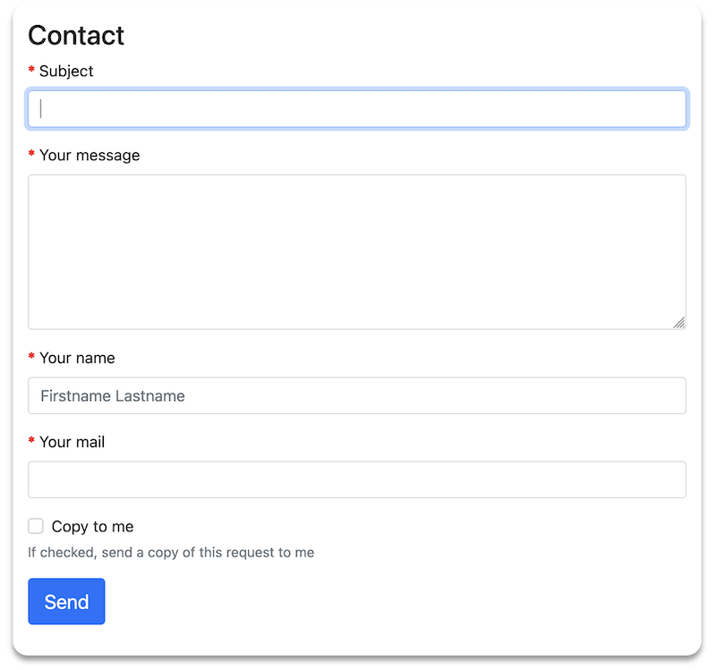

# Svc/ContactformBundle

 
 
 

:warning: **Attention:**  
From version 4.0 the bundle works only with Symfony >=6.1, because the new Bundle Configuration System is used. 
From version 5.3.0 routes are configured in PHP instead of YAML - **manual route import required**. 
Please use version 3.x for older Symfony installations.

## Bundle for a contact form and sending the mail with contact info

* [Installation](docs/installation.md)
* [Usage](docs/usage.md)

### Screenshot

